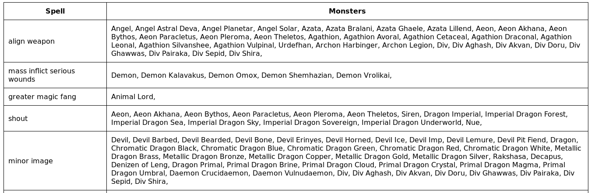
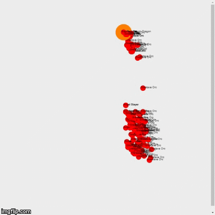

# BDD Répartit Devoir 2

## Groupe :
- Nicolas Corronel
- Johan Maurel

### Exercices :
- Respectivement les exercices 1 et 2 sont dans les dossiers source correspondant, le crawler en python est dans le dossier crawler.

- **BONUS CLUSTER :** Le dossier deploy-cluster, permet le deployement d'un cluster Spark + Hadoop avec Docker (script docker-compose). Comme nous n'avons pas à disposition énormement de machine nous avons décidé de le simuler avec des conteneurs logiciels dans un réseau privé local.

Voici un petit screen du websocket du master.

### Exercices 1 :

Le crawler est en python et produit un fichier JSON.

Le resultat du map reduce est un tableau sous forme de tableau en page web.

### Exercices 2 :

Le programme génère un fichier texte (à la racine) pour le resultat de la simulation, a chaque ligne on obtient les valeurs des entités sur le plateau, ciblé par leur Id respectif, tout les '#' on change de tour et chaque fois qu'un Id disparait c'est que l'entité est morte. Pour infomation elles sont placé aléatoirement dans une zone bien définie.

On peut visualiser la simulation sur la page html dans le dossier 'Visualisation'. 

Un toggle switch est placé en haut à gauche de la fenêtre de navigation afin de passer de la simulation 1 à 2.
La simulation actuellement à l'écran est affiché dans un label à côté du toggle switch.

##### Simulation 2 :

