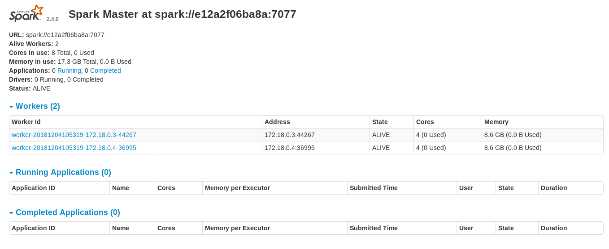

# BDD Répartit Devoir 2
## Groupe :
- Nicolas Corronel
- Johan Maurel

### Exercices :
- Respectivement les exercices 1 et 2 sont dans les dossiers source correspondant, le crawler en python est dans le dossier crawler.

- **BONUS CLUSTER :** Le dossier deploy-cluster, permet le deployement d'un cluster Spark + Hadoop avec Docker (script docker-compose). Comme nous n'avons pas à disposition énormement de machine nous avons décidé de le simuler avec des conteneurs logiciels dans un réseau privé local.

Voici un petit screen du websocket du master.

